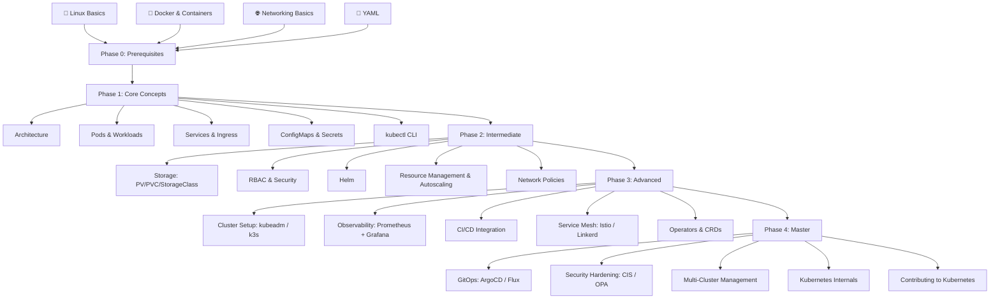

# Kubernetes Roadmap — Full Path

## Visual Overview



---

## Phase 0 — Prerequisites
**Goal:** Be comfortable with the tools Kubernetes builds on top of.

- [[00-Prerequisites/Linux-Basics|Linux Basics]] — file system, processes, systemd, networking commands
- [[00-Prerequisites/Docker-Fundamentals|Docker Fundamentals]] — images, containers, volumes, networking, Dockerfile
- [[00-Prerequisites/Networking-Basics|Networking Basics]] — TCP/IP, DNS, HTTP, load balancers, ports
- [[00-Prerequisites/YAML|YAML]] — syntax, anchors, multi-document files

**Exit criteria:** You can write a Dockerfile, run containers, and read a YAML manifest without help.

---

## Phase 1 — Core Concepts
**Goal:** Understand how Kubernetes works and deploy your first applications.

- [[01-Core-Concepts/Architecture|Architecture]] — API server, etcd, scheduler, controller manager, kubelet
- [[01-Core-Concepts/Pods|Pods]] — lifecycle, multi-container, init containers, probes
- [[01-Core-Concepts/Workloads|Workloads]] — Deployments, ReplicaSets, StatefulSets, DaemonSets, Jobs, CronJobs
- [[01-Core-Concepts/Networking|Networking]] — Services (ClusterIP, NodePort, LoadBalancer), Ingress, DNS
- [[01-Core-Concepts/Configuration|Configuration]] — ConfigMaps, Secrets, environment variables
- [[01-Core-Concepts/kubectl|kubectl]] — essential commands, contexts, namespaces

**Exit criteria:** You can deploy, scale, expose, and update an app on a local cluster.

---

## Phase 2 — Intermediate
**Goal:** Operate Kubernetes in production-like conditions.

- [[02-Intermediate/Storage|Storage]] — PersistentVolumes, PersistentVolumeClaims, StorageClasses, CSI
- [[02-Intermediate/RBAC|RBAC]] — Roles, ClusterRoles, RoleBindings, ServiceAccounts
- [[02-Intermediate/Network-Policies|Network Policies]] — ingress/egress rules, namespace isolation
- [[02-Intermediate/Resource-Management|Resource Management]] — requests/limits, LimitRanges, HPA, VPA, KEDA
- [[02-Intermediate/Helm|Helm]] — charts, values, repositories, upgrades, rollbacks

**Exit criteria:** You can pass CKA/CKAD exam topics. You can deploy a stateful app with proper RBAC.

---

## Phase 3 — Advanced
**Goal:** Build, secure, and observe production clusters.

- [[03-Advanced/Cluster-Setup|Cluster Setup]] — kubeadm, k3s, managed clusters (EKS/GKE/AKS), HA control plane
- [[03-Advanced/Observability|Observability]] — Prometheus, Grafana, Loki, OpenTelemetry, alerting
- [[03-Advanced/CICD|CI/CD]] — GitLab CI, GitHub Actions, Tekton, ArgoCD (intro)
- [[03-Advanced/Service-Mesh|Service Mesh]] — Istio, Linkerd, traffic management, mTLS, observability
- [[03-Advanced/Operators|Operators & CRDs]] — CustomResourceDefinitions, controller-runtime, Operator SDK

**Exit criteria:** You can build a cluster from scratch, instrument it with observability, and deploy via CI/CD.

---

## Phase 4 — Master
**Goal:** Deep expertise, security, and contribution to the ecosystem.

- [[04-Master/GitOps|GitOps]] — ArgoCD, Flux, app-of-apps, multi-tenant delivery
- [[04-Master/Security|Security Hardening]] — CIS Benchmarks, OPA/Gatekeeper, Falco, Pod Security Standards
- [[04-Master/Multi-Cluster|Multi-Cluster]] — Cluster API, Federation, KubeFed, Submariner
- [[04-Master/Internals|Kubernetes Internals]] — API machinery, admission webhooks, scheduler extenders, etcd deep dive
- [[04-Master/Contributing|Contributing]] — SIGs, KEPs, local dev setup, submitting PRs

**Exit criteria:** You can design and operate multi-cluster platforms, pass CKS, and contribute upstream.

---

## Certifications Map

```
Phase 1 + 2  ──►  CKA  (Certified Kubernetes Administrator)
Phase 1 + 2  ──►  CKAD (Certified Kubernetes Application Developer)
Phase 2 + 3  ──►  CKS  (Certified Kubernetes Security Specialist)
```

---

## Suggested Timeline

| Phase | Pace (2h/day) | Pace (4h/day) |
|-------|---------------|---------------|
| 0 – Prerequisites | 3 weeks | 2 weeks |
| 1 – Core Concepts | 4 weeks | 2 weeks |
| 2 – Intermediate | 6 weeks | 3 weeks |
| 3 – Advanced | 8 weeks | 4 weeks |
| 4 – Master | Ongoing | Ongoing |

---

## Tools You Will Use

| Tool | Purpose |
|------|---------|
| `kubectl` | Primary CLI |
| `minikube` / `kind` / `k3d` | Local clusters |
| `helm` | Package manager |
| `k9s` | Terminal UI |
| `kubectx` / `kubens` | Context/namespace switching |
| `stern` | Multi-pod log tailing |
| `kustomize` | Manifest templating |
| `argocd` CLI | GitOps |
| `kubeadm` | Cluster bootstrapping |
